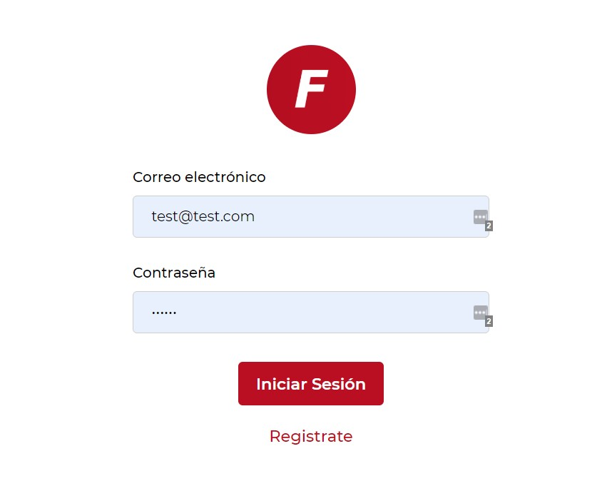
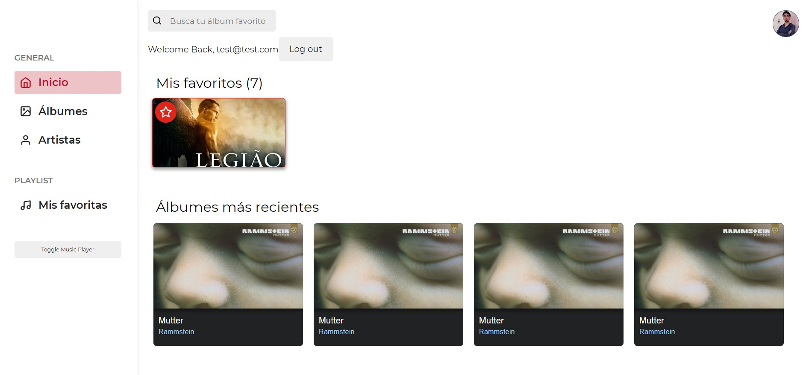
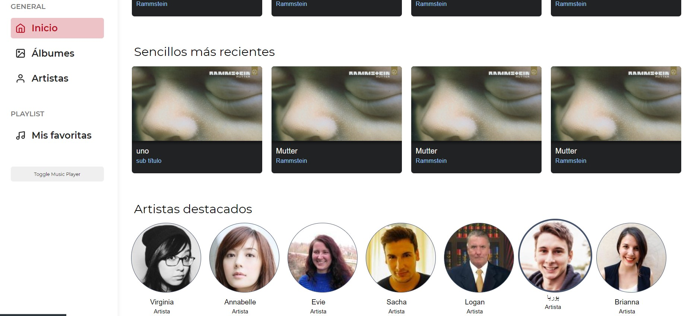
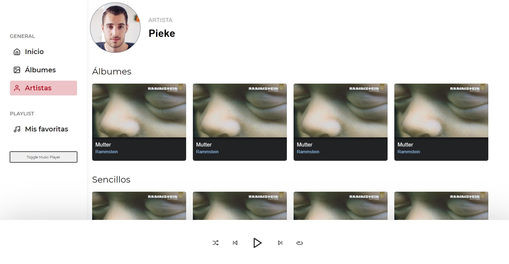

# music-player-frontend

<!-- TODO: Add description -->












### Tecnologies

- Enviroment: `JavaScript ES6`
- Framework: `Reactjs`
- Framework CSS: `Material UI`
- Request: `axiosjs`

### Start

```sh
$ npm install

$ npm start
```